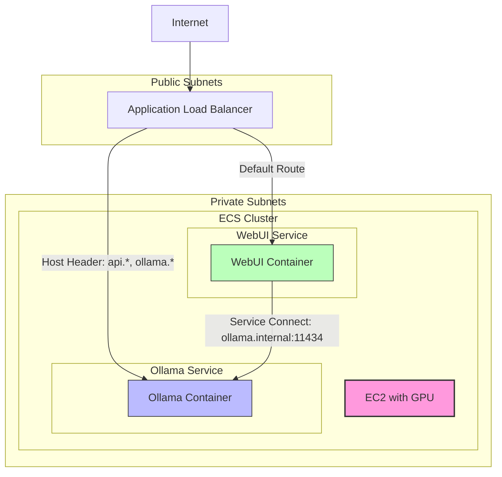

# Ollama with WebUI on AWS ECS with GPU Support

This project deploys [Ollama](https://ollama.ai/) and [Open WebUI](https://github.com/open-webui/open-webui) on AWS ECS with GPU support, allowing you to run large language models locally with a user-friendly interface.

## Architecture Overview

The infrastructure consists of:

- ECS cluster running on EC2 instances with GPU support (g4dn.xlarge)
- Ollama service for running LLMs
- Open WebUI service for the user interface
- Application Load Balancer for routing traffic
- Service Connect for service discovery
- CloudWatch for logging



## Features

- **GPU Acceleration**: Uses g4dn.xlarge instances with NVIDIA T4 GPUs
- **Secure Architecture**: Services run in private subnets with public access through ALB
- **Service Discovery**: Uses ECS Service Connect for internal communication
- **Logging**: CloudWatch logs with 1-day retention

## Prerequisites

- AWS Account
- VPC with public and private subnets
- NAT Gateway for outbound internet access from private subnets
- Terraform installed

## Deployment

1. Clone this repository
2. Update `terraform.tfvars` with your configuration
3. Initialize Terraform:

   ```
   terraform init
   ```

4. Apply the configuration:

   ```
   terraform apply
   ```

## Accessing the WebUI

After deployment, you can access the WebUI using the URL provided in the Terraform outputs:

```
terraform output webui_url
```

## Loading Models

To load a model, you can use the provided curl command:

```
terraform output model_pull_command
```

This will pull the DeepSeek-R1 7B model. You can modify this command to pull other models.

## SSH Access via AWS Systems Manager (SSM)

The EC2 instances are configured to use AWS Systems Manager Session Manager for secure shell access without requiring public IP addresses or opening SSH ports.

### Prerequisites for SSM Access

1. Install the AWS CLI and Session Manager plugin:

   ```bash
   # Install AWS CLI
   curl "https://awscli.amazonaws.com/awscli-exe-linux-x86_64.zip" -o "awscliv2.zip"
   unzip awscliv2.zip
   sudo ./aws/install

   # Install Session Manager plugin
   curl "https://s3.amazonaws.com/session-manager-downloads/plugin/latest/mac/sessionmanager-bundle.zip" -o "sessionmanager-bundle.zip"
   unzip sessionmanager-bundle.zip
   sudo ./sessionmanager-bundle/install -i /usr/local/sessionmanagerplugin -b /usr/local/bin/session-manager-plugin
   ```

2. Configure AWS CLI with appropriate credentials:

   ```bash
   aws configure
   ```

3. Add the following to your `~/.ssh/config` file to enable SSH access via SSM:

   ```
   # SSH over Session Manager
   Host i-* mi-*
       ProxyCommand sh -c "aws ssm start-session --target %h --document-name AWS-StartSSHSession --parameters 'portNumber=%p'"
       StrictHostKeyChecking no
       User ec2-user
       IdentityFile ~/.ssh/id_rsa

   # Named instance example (replace INSTANCE_ID with your actual instance ID)
   Host ollama-gpu
       HostName INSTANCE_ID
       ProxyCommand sh -c "aws ssm start-session --target %h --document-name AWS-StartSSHSession --parameters 'portNumber=%p'"
       StrictHostKeyChecking no
       User ec2-user
       IdentityFile ~/.ssh/id_rsa

   # You can also specify a specific AWS profile if needed
   Host ollama-gpu-prod
       HostName INSTANCE_ID
       ProxyCommand sh -c "aws --profile production ssm start-session --target %h --document-name AWS-StartSSHSession --parameters 'portNumber=%p'"
       StrictHostKeyChecking no
       User ec2-user
       IdentityFile ~/.ssh/id_rsa
   ```

   With this configuration, you can simply use `ssh ollama-gpu` to connect to your instance.

### Connecting to EC2 Instances

1. List available instances:

   ```bash
   aws ec2 describe-instances --filters "Name=tag:Name,Values=ecs-gpu-instance" --query "Reservations[*].Instances[*].[InstanceId,State.Name,Tags[?Key=='Name'].Value|[0]]" --output table
   ```

2. Start an SSM session:

   ```bash
   aws ssm start-session --target INSTANCE_ID
   ```

3. For port forwarding (if needed):

   ```bash
   aws ssm start-session --target INSTANCE_ID --document-name AWS-StartPortForwardingSession --parameters "portNumber"=["8080"],"localPortNumber"=["8080"]
   ```

### Troubleshooting ECS on the Instance

Once connected to the instance, you can troubleshoot ECS:

```bash
# Check ECS agent status
sudo systemctl status ecs

# View ECS agent logs
sudo journalctl -u ecs

# Check Docker status
sudo systemctl status docker

# List Docker containers
sudo docker ps

# Check GPU status
nvidia-smi

# View ECS container logs
sudo tail -f /var/log/ecs/ecs-agent.log
```

## Security Considerations

- All services run in private subnets
- No direct SSH access to instances (SSM used instead)
- Security groups restrict traffic flow
- Load balancer is the only component exposed to the internet

## Maintenance

### Updating Models

To update or add new models:

```bash
curl -X POST http://<ALB_DNS>/api/pull -d '{"name": "MODEL_NAME"}'
```

### Scaling

To adjust the number of instances:

```bash
# Update min, max, and desired capacity
aws autoscaling update-auto-scaling-group --auto-scaling-group-name ecs-gpu-asg --min-size 2 --max-size 4 --desired-capacity 2
```

## Troubleshooting

### Common Issues

1. **GPU not detected**: Check NVIDIA driver installation with `nvidia-smi`
2. **Services not starting**: Check ECS service events in AWS Console
3. **Cannot connect to WebUI**: Verify security groups and load balancer health checks

### Viewing Logs

```bash
# View WebUI logs
aws logs get-log-events --log-group-name /ecs/webui-service --log-stream-name <LOG_STREAM>

# View Ollama logs
aws logs get-log-events --log-group-name /ecs/ollama-service --log-stream-name <LOG_STREAM>
```

## Cost Optimization

- g4dn.xlarge instances cost approximately $0.526/hour
- Consider stopping instances when not in use
- CloudWatch logs are configured with 1-day retention to minimize storage costs

## License

This project is licensed under the MIT License - see the LICENSE file for details.
